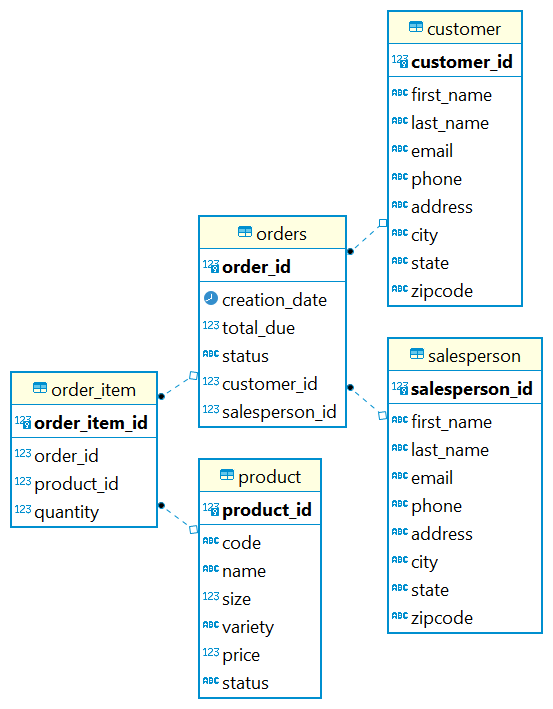

# Introduction
The JDBC application set up a simple connection between Java application and Postgres SQL
database for data accessing. Maven is used to bring JDBC driver onto the class path and 
manage our project. Data Access Object (DAO) is implemented to perform CRUD functions on 
objects (DTO).

# Implementaiton
## ER Diagram

## Design Patterns
Data Access Object pattern also known as DAO pattern is utilized in our application to 
create an abstraction layer between the raw JDBC and our code and provide solid encapsulation
of complex joins, aggregation, etc. A `DataAccessObject` class has been implemented and extended
by two other classes, `CustomerDAO` and `OrderDAO`. These classes CRUD (create, read, update, delete) 
`DataTransObjects` in our application.

In contrast, repository pattern works with single table per class and instead of joining tables 
in the databases, it joins them in code. When an application is horizontally scalable, repository
pattern fits better, because it allows developers to shard its database in a way that the 
developers can focus on single table access instead of access the entire database.

# Test
How you test your app against the database? (e.g. database setup, test data set up, query result)
