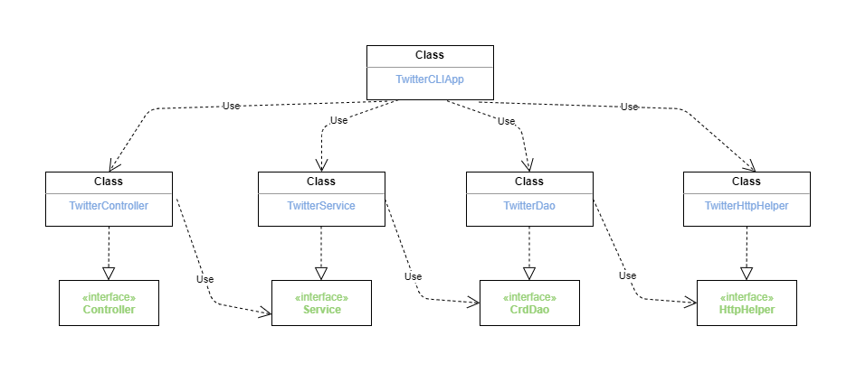

# Introduction

The project has implemented a Twitter App in Java and the project is managed and built using Maven. The app connects to a Twitter REST API using java libraries, OAuthConsumer and HttpClient. CRUD functionalities were implemented so users could post, search and delete Twitter posts using the app through the command line.

* Designs: MVC and DAO design pattern.

# Quick Start
* Usage:
  `TwitterApp post|show|delete [options]`
1. Maven: Before building the app the user must obtain API key, API Secret Key, Access Token, and
Token Secret from Twitter API on 
 
```
# build package using maven 
mvn clean package

# run jar file
java -jar -cp target/twitter-1.0-SNAPSHOT.jar post|show|delete [options]
```

2. Docker
```
# pull docker image
docker pull tinalee262008/twitter

# create and run docker container
docker run --rm \
-e consumerKey=YOUR_VALUE \
-e consumerSecret=YOUR_VALUE \
-e accessToken=YOUR_VALUE \
-e tokenSecret=YOUR_VALUE \
tinalee262008/twitter post|show|delete [options]
```

# Design
## UML diagram



* `TwitterDao` class is the layer class that establishes a connection with the REST API and handles HTTP requests and responses, using the helper class `TwitterHttpHelper`. Also, it serializes and deserializes JSON and model objects.


* `TwitterService` class is the layer class that handles the business logic. It calls the DAO layer, `TwitterDao`, to interact with the external storage, database and REST API.


* `TwitterController` class is the layer class that interacts with the client and parses user input. Then it calls the service layer, `TwitterService`, to check business logic.


* `TwitterCLIApp` is the layer class that initiates all dependent components and calls the `run` method, which takes command-line arguments, performs an HTTP request, and prints response body tweets.


## Models
Implemented 5 classes to represent simplified version of the Tweet Model.
* `Tweet` is the simplified version of the Twitter Tweet model.
* `Entites` contains hashtags and user mentions.
* `Hashtag` shows the hashtag text in a tweet post
* `UserMention` shows the users that has been mentioned in a tweet post
* `Coordinates` represents the geo location of the user when posting the tweet. It is a list containing latitude and longitude.

## Spring
In the `TwitteCLIApp` class, we used main function to manually initiated all components and dependencies. However, it
is not very convenient to do so. This is where Spring framework came in and solves the Dependency management problem.


* First we implemented `TwitterCLIBean` to define dependency relationship using `@Bean` and pass dependency through method arguments. Then an IoC container is created to automatically initiate all Beans based on the relationship specified. Lastly, we get an entry point from TwitterCLIApp and run the application.


* `TwitterCLIComponentScan` is implemented to reduce repetitive manual work. This approach uses `@Autowired`annotation to tell the IoC container to inject dependency through the constructor. In addition, we also need to specify `@Component`, Beans, so the IoC container knows where to find and build the Beans.


* `TwitterCLISpringBoot` is implemented to configure TwitterCLIApp with SpringBoot.
# Test
JUnit is used to perform integration tests on all classes and Mockito framework is used to test classes with dependency utilizing the ability to mock the dependency.

## Deployment
First, a Dockerfile is implemented. Then we creat a new image using the Dockerfile and push the newly created image to Docker Hub.
```
# Dockerfile
FROM openjdk:8-alpine
COPY target/twitter*.jar /usr/local/app/twitter/lib/twitter.jar
ENTRYPOINT ["java", "-jar", "/usr/local/app/twitter/lib/twitter.jar"]
```

# Improvements
- Allow user to filter resulting tweet by passing in a field argument
- A function that searches all existing tweet id
- Allow user to edit or update a tweet