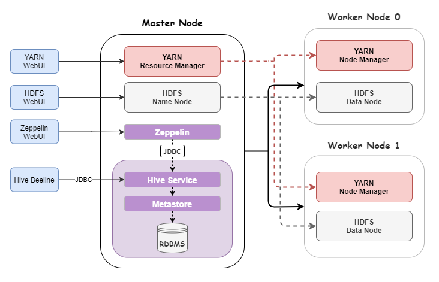

Table of contents
* [Introduction](#Introduction)
* [Hadoop Cluster](#Hadoop-Cluster) 
* [Hive Project](#Hive-Project)
* [Improvements](#Improvements)

# Introduction
This Hadoop project is to help us evaluate Hadoop ecosystem and how it works with a distributed system to 
store and process data. The Hadoop cluster is built on Google Cloud Platform using Dataproc. There is one master node
and two worker nodes in the cluster. This project allows me to get familiar with the hadoop ecosystem and learn
how to use its components such as Hadoop MapReduce, Hive, YARN, etc to perform data extraction and data
analysis. The project is implemented and deployed using Zeppelin Notebook using Hive query Language.

# Hadoop Cluster
A Hadoop cluster is set up on Google Could Platform, which contains 1 master node and 2 worker nodes.

### Hardware specifications
* 1 master node
* 2 worker nodes
* 2 cores on each node
* 13GB RAM
* 100GB of disk space

### Big data tools evaluated 
* **Hadoop Distributed File System (HDFS):** A distributed file system that comes with Hadoop. It 
  consists a Name Node and many Data nodes. The Name Node is the master node that manages the file 
  system metadata, such as permission, location, and names while Data Node is a slave node in HDFS 
  that store blocks of data as instructed by the Name Node.
  

* **Yet Another Resource Negotiator (YARN):** A tool that manage the computing resource of your cluster.
  It consists one Resource manager and multiple Node managers. The Resource Manager and Node Managers 
  are in a master/slave relationship. Both Resource Manager and Node Managers are instances of JVMs. 
  Resource Manager is the master that arbitrates all the available cluster resources and thus helps 
  manage the distributed applications running on the YARN system. Node Managers are running on worker 
  machines that monitor containers compute resources, such as the available number of CPU cores, RAM, 
  and disk and network I/O. 

* **MapReduce:** MapReduce(MR) is a programming model. Although it's not intuitive, it's very suitable for processing and generating big data sets with a parallel, distributed algorithm on a cluster.

* **Hive:** Apache Hive is an open source data warehouse software for reading, writing and managing 
  large data set files that are stored directly in either the Apache Hadoop Distributed File System (HDFS) 
  or other data storage systems such as Apache HBase. Hive enables SQL developers to write Hive Query 
  Language (HQL) statements that are similar to standard SQL statements for data query and analysis. 
  It is designed to make MapReduce programming easier because you don’t have to know and write lengthy 
  Java code. Instead, you can write queries more simply in HQL, and Hive can then create the map and 
  reduce the functions.

* **Zeppelin:** A web interactive UI that allows users to execute queries and display the result in
a notebook format.

# Hive Project
There are a few ways we used to optimized Hive queries:
* **Partition:** Data can be split into partitions. This allows the search to scan through particular sets 
  instead of the entire table/HDFS files.
* **Columnar-format:** `wdi_2016` csv file is converted and saved as a parquet file. Parquet file stores
  data by column and not by row. This allows for fast retrieval of columns of data.
* **Spark.sql:** spark execution engine emphasis in-memory intermediate computation, which avoid constantly
writing intermediate output to local disk. This helps to reduce the read and write time.

### Zeppelin Notebook screenshot

# Improvements
- Save the file as ORCFile in HDFS to optimize runtime
- Use User-defined functions to transform data
- Increase cluster size 