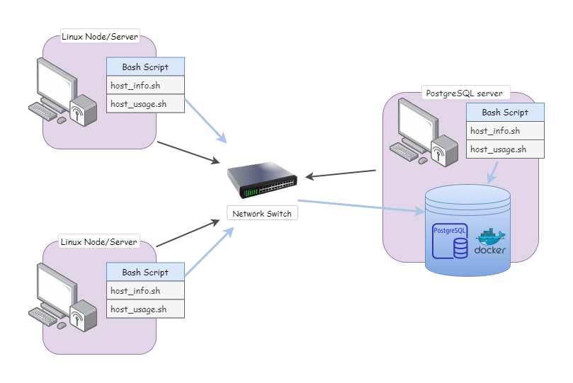

# Introduction
The Cluster monitoring Agent is designed to parse hardware information and resource usage of each node/server 
managed by the Jarvis Cluster Administration (LCA). Each server runs CentOS 7 and they communicate internally 
through IPv4 addresses. Bash scripts are written to automatically parse resource usage data every minute and 
data parsed will be safely stored in a PostgresSQL database, a database container created by Docker Postgres image. 
Later, the LCA team will use the data to perform data analysis and future resource planning.

# Quick Start
This guide walks you through the monitoring agent solution. \
(Note: Docker and psql CLI client must be downloaded before executing the following code)
1) Create database and tables
```
# Start a psql instance using psql_docker.sh
./scripts/psql_docker.sh create [db_username] [db_password]

# Check if container is running 
docker ps -f name=jrvs-psql

# Navigate into psql instance using psql cli
psql -h psql_host -U psql_user

# Now you should be in psql REPL 
# Create database (type \q to quit psql REPL)
CREATE DATABASE db_name;

# You should now be exited from psql REPL
# Create tables to store hardware specifications and resource usage
psql -h psql_host -U psql_user -d host_agent -f sql/ddl.sql
```
2) Insert hardware specs into psql
    We can now collect hardware information from server and store it into `host_info` table inside `host_agent` database.
```
./scripts/host_info.sh psql_host psql_port db_name psql_user psql_password
```
3) Insert resource usage data into psql
    Stores resource usage data of server and store it into `host_usage` table inside `host_agent`.
```
./scripts/host_usage.sh localhost 5432 host_agent [db_username] [db_password]
```
4) Crontab setup
    Set up crontab to parse resource usage evey 1 minute.
```
# edit crontab tasks 
crontab -e

# add this to crontab
* * * * * bash path/host_usage.sh  psql_host psql_port db_name psql_user psql_password > /tmp/host_usage.log

#list crontab jobs
crontab -l

# you could verify that crontab is running 
cat /tmp/host_usage.log
```

# Implementation
1. Created a bash script `psql_docker.sh` to provision a PSQL instance using docker.
1. Then `ddl.sql` is created to initialize database `host_agent` and tables `host_info` and `host_usage`
1. After the database is successfully created, `host_info.sh` and `host_usage` are implemented to insert hardware 
   specification data and usage information of the server.
1. Used `crontab` command to parse resource usage and send data to database every one minute .
1. Created a `queries.sql` to query data from database for usage information and failure detection.
## Architecture
This diagram shows how clustered servers communicate with each other through a switch and the flow of how data is 
stored into a PostgresSQL database. Each server will have its copy of bash shell scripts that automatically parse 
resource usage and store data into a database.



## Scripts
* `psql_docker.sh`
* `ddl.sql`
* `host_info.sh`
* `host_usage.sh`
* `queries.sql`
## Database Modeling
* `host_info` table

Column Name | Data Type | Description
------------ | ------------- | -----------
id | SERIAL | Primary key in the table
hostname | VARCHAR | Name of the server. Each server must have a unique name
cpu_number | INT | Number of CPUs in the server
cpu_architecture | VARCHAR | Architecture information of the server
cpu_model | VARCHAR | CPU Model of the server
cpu_mhz | FLOAT | CPU mhz
L2_cache | INT | Indicate L2 cache information of the server
total_mem | INT | Indicate total memory information of the server 
timestamp | TIMESTAMP | Date and time when host_info.sh is executed
  
* `host_usage` table

Column Name | Data Type | Description
------------|-----------|------------
timestamp | TIMESTAMP | Date and time
host_id | INT | id of the server, references id in `host_info`
memory_free | INT | Free memory on the server in MB
cpu_idle | INT | Time spent in idle (percentage)
cpu_kernel | INT | Time spent running kernel code (percentage)
disk_io | INT | Number of Input/Output of the server
disk_available | INT | Available disk of root directory in MB 

# Test
* For bash scripts, they're tested manually by executing them in terminal and all the testing results are as expected.
* `ddl.sql` script is manually tested by executing it in the terminal and checking if table were successfully created.
* `queries.ddl` is tested by inserting sample data into the tables and calling each query independently in the console.


# Improvements
* Send out alert when certain resource is overused
* Generate resource usage report every hour 
* 

