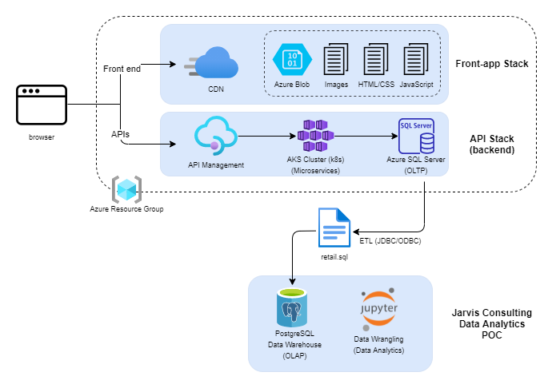

# Introduction
This project aims to help London Gift Shop (LGS) to analyze customer behavior to increase profit and sales. Python
libraries such as Pandas, NumPy, and Matplotlib were used to perform data analysis on their transactional data and resulting analytics
are recorded in a Jupyter Notebook. Later, LGS uses the analytics to plan for the future marketing campaign to increase their revenue.
 
# Implementation
## Project Architecture

The LGS team has its Azure system that stores their transactional data, but as a junior Jarvis developer, I do not have access to their system. Instead, they provided a SQL file that contains transactional
data between 01/12/2009 and 09/12/2011. This data is then loaded to a PostgreSQL database (data warehouse) to perform
data analysis.

## Data Analytics and Wrangling
- Discuss how would you use the data to help LGS to increase their revenue (e.g. design a new marketing strategy with data you provided)

- Monthly placed and canceled orders
- Monthly Sales, Monthly sales growth, monthly active users: Able to learn the peak periods so LGD could apply more marketing campaigns or sales events
  in those periods to increase sales.
- New and Existing users: Compares the monthly orders made by new customers and existing customers. Since there are more existing customer orders every month, LGS should focus on the existing customers and make sure those loyal customers always have a positive experience to keep them as active users. On the other hand, LGS should create marketing strategies to turn
  new customers to loyal customers.
- RFM segmentation: A common strategy that allows us to divide our customers into different groups and how to approach each group. Categorizing customers allows the LGS marketing team to distribute resources and perform different marketing strategies for each group.

# Improvements
- Predict future sales trends for LGS
- Perform data analytics on different models (ex. product purchased)
- Create and compare yearly revenue reports 