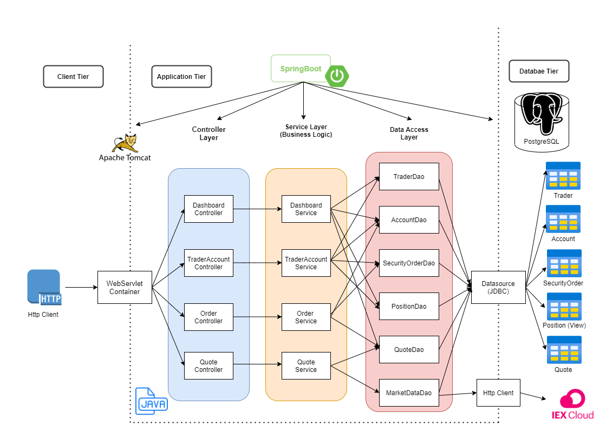
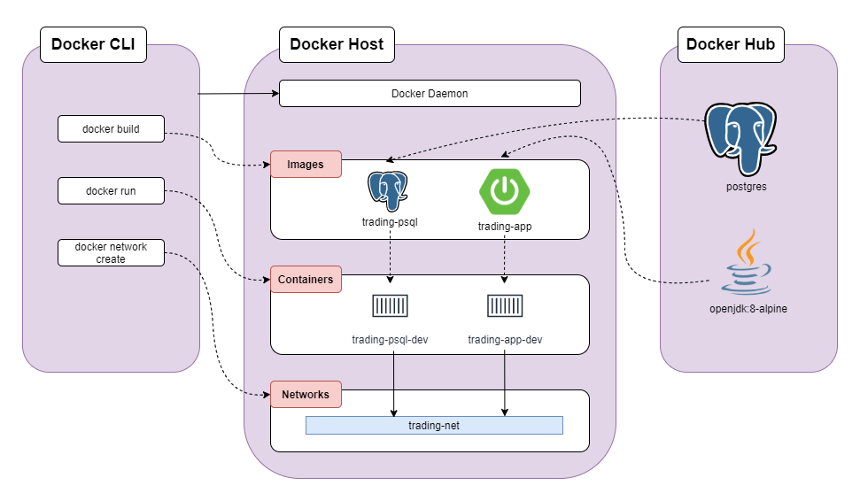

Table of contents
* [Introduction](#Introduction)
* [Quick Start](#Quick-Start)
* [Implementaion](#Implementation)
* [Test](#Test)
* [Deployment](#Deployment)
* [Improvements](#Improvements)

# Introduction
This Spring boot application is built using Java and managed and packaged by Maven and Spring boot. It stimulates an online stock trading platform and manages user trader profiles and accounts. Users can deposit or withdraw funds to buy or sell stocks. The application is designed using MVC and microservice architecture, so the application is split into smaller services. IEX Cloud is used to get stock price information, and docker Postgres is used to store trader profile, accounts,
and security orders.

# Quick Start
**Prequiresites**: Docker (version 17.05 or higher), CentOS 7, IEX public token, Maven, Java 8

**Docker scripts** 

The application contains two docker containers `trading-psql` and `trading-app`. We will need to build 
each image using this following scripts:
```
# build trading-psql
cd ./springboot/psql
docker build -t trading-psql .  #docker builds ./Dokcerfile by default
docker image ls -f reference=trading-psql

# build trading-app
cd ./springboot/
docker build -t trading-app . #docker builds ./Dokcerfile by default
docker image ls -f reference=trading-app
```

Then we need to create a docker network that allows `trading-psql` and `trading-app` to communicate
with each other.
```
#create a new docker network
sudo docker network create trading-net

#verify
docker network ls
```

Finally, create build docker containers and run application. 
```
#start a docker container
#attached the container to the trading-net network
docker run --name trading-psql-dev \
-e POSTGRES_PASSWORD=password \
-e POSTGRES_DB=jrvstrading \
-e POSTGRES_USER=postgres \
--network trading-net \
-d -p 5432:5432 trading-psql

#set IEX credential
IEX_PUB_TOKEN="your_token"
#start trading-app container which is attached to the trading-net docker network
docker run --name trading-app-dev \
-e "PSQL_URL=jdbc:postgresql://trading-psql-dev:5432/jrvstrading" \
-e "PSQL_USER=postgres" \
-e "PSQL_PASSWORD=password" \
-e "IEX_PUB_TOKEN=${IEX_PUB_TOKEN}" \
--network trading-net \
-p 8080:8080 -t trading-app
```

Try trading-app with SwaggerUI (http://localhost:8080/swagger-ui.html)


# Implemenation
## Architecture


- **Controller layer:** Handles client http requests and check input arguments. Webservlet will map http request
  to corresponding controller.
- **Service layer:** Handles and check business logic. It makes sure client requests can be performed or else
  throw an exception.
- **DAO layer:** The layer that perform CRUD functionalities. It connects and retrieve data from external data source. In
  our application it fetches stock information from IEX Cloud and persist and retrieve data from PostgreSQL.
- **SpringBoot:** WebServlet/TomCat in springboot handles the http client requests and packages http response back
  to the client. On the other hand, IoC container in springboot manage components (Controller, Service and Dao) and
  dependencies.
- **PSQL and IEX**: External data source, where we fetch and persist our data. PSQL is used to store trader profile,
accounts, orders, and quote information and IEX is used to retrieve stock market data.

## REST API Usage
### Swagger
Swagger is a powerful yet easy-to-use suite of API developer tools for teams and individuals, enabling development across the entire API lifecycle, from design and documentation, to test and deployment.

### Quote Controller
This controller acquired stock market data from IEX, and convert it into POJO and persist it in PSQL database. It could also
could get all tickers available on this trading platform.
- GET `/quote/dailyList`: Show all tickers that are available to traded on this platform.
- GET `/quote/iex/ticker/{ticker}`: List latest information about given ticker.
- POST `/quote/tickerId/{tickerId}`: Fetch given ticker from IEX cloud and ddd given ticker to this trading platform 
- PUT `/quote/`: Update a given quote in the quote table.
- PUT `/quote/iexMarketData`: Fetch the latest information for all quotes in quote table and update quote table.
### Trader Controller
A controller that manage trader profile and account. Trader could deposit or withdraw fund from his/her account.
- POST `/trader/`: Create a trader account using trader information given in HTTP request body.
- POST `/trader/firstname/{firstname}/lastname/{lastname}/dob/{dob}/country/{country}/email/{email}`: Create a trader account using URL.
- PUT `/trader/deposit/traderId/{traderId}/amount/{amount}`: Deposit fund to account associated with given traderId.
- PUT `/trader/withdraw/traderId/{traderId}/amount/{amount}`: Withdraw fund from account associated with given traderId.
- DELETE `/trader/traderId/{traderId}`: Delete trader by given traderId. Account balance must be zero and all positions
must be closed before deleting a trader.
### Order Controller (Optional - Not implemented)
A controller that handles buying and selling stocks/shares. 
- POST `order/marketOrder`: Execute buying and selling orders.
### Dashboard controller (Optional - Not implemented)
A controller that display portfolio or profile of a trader.
- GET `/dashboard/portfolio/traderId/{traderId}`: Displays trading portfolio of given traderId.
- GET `/dashboard/profile/traderId/{traderId}`: Displays profile of given traderId.

# Test
The application is tested using JUnit4 integration tests with coverage more than 60 percent.

# Deployment


To deploy the application, two Dockerfiles are implemented. One Dockerfile is for creating a Postgres image with initialized tables and the other one is for our application. The `docker build` command is called to build two images `trading-app` and `trading-psql` from base images postgres and openjdk:8-alpine. Once the images are built `trading-psql-dev` and `trading-app-dev` containers are created using `docker run`
command and trading-net docker network is bind to the containers for communications.

# Improvements
- Add feature that allows users to make market or limit orders.
- Allow users to transfer funds between accounts.
- Let users to create a watch list that store securities they want to track. 